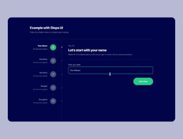
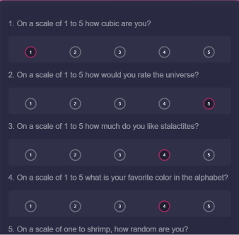
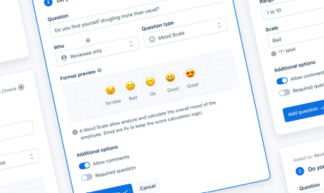
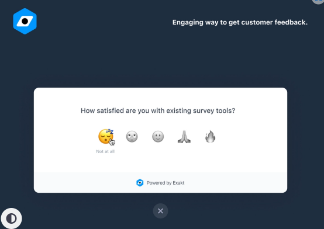

# SURVEY FOR THE MINOR - WEB

This project is focused on web accessibility. The web has to accessible to everyone. For this project, i am going to make website that is accessible to everyone. This website should be able to work on all browsers

## What is the userstory?

I would want to be able to fill in a survey about the minor Web development. with different multiple answers. I would also want to know where i am in the form and what my next step is . I would also want to see already filled in questions . If i am not able to finish with filling in the survey, i would like to be able to continue from where i stopped or got to.

## Requirements for the survey

-   Name of student
-   Name of lecturer or lecturers
-   The week in which you followed this course
-   Grade from a scale of 1 to 10
-   Lessons ( How difficult it is )
-   Explain( Was this course well taught)
-   Personal understanding ( How well dom you understand it )

-   Validation
    -   The survey has to be complete
    -   Provide clear error messages
    -   Decide for yourself when and how the validation will take place
-   Make a clear interface tat allows the user to go back to previous questions (And maybe also skip to a question)
-   Clear interface that indicates where you are in the survey
-   Visible radio buttons are not allowed only if css is been applied.
-   The form should have a darkmode and light mode

## Core functionalities of my survey

-   Indicate where you are in the survey
-   Placeholder in the labels
-   All the questions wont be displaced at ones
-   Survey should be presentable without css
-   Survey should work without js
-   Validation should be shown in text with no red color for people who are color blind
-   A good contrast between the background and the foreground.
-   Labels, submit buttons should be able to work .

## Inspirations

Went on pinterest looking fot inspirations for my specific design for my survey. Like how i want to visualize the grade question.

**Inspiration for layout**

**Inspiration for grading**

## Process

## Form validation

## what is form validation? 

Form validation is the process of ensuring that the data entered into a web form is correct and meets certain criteria before it is submitted to the server. It is an important aspect of web development as it helps prevent errors and ensures that the data collected is accurate and consistent.

## Form validation with html ? 

HTML provides a few built-in form validation attributes that can be added to form elements to ensure that the data entered meets certain criteria. These attributes work on the client-side using JavaScript and can provide immediate feedback to the user.

- Required attributes. I used the required attributes for the email inout to make it a required field so if the input is left bkank, a validation error message will appear.

- Pattern Attribute. i used the pattern atrribute to specify a regular expression that the data must match . With the student id. I made a added the pattern to the input so when the id provided by the user is less than 9 numbers. The error message then shows. 

## Form validation with CSS? 

Form validation in CSS can be done using the :valid and :invalid pseudo-classes. When a user inputs data into a form field, these pseudo-classes can be used to style the input based on whether the data entered is valid or not.

I used the valid and invalid pseudo classes for my inputs with the has selector. The has selector does not work on firefox.

For 

## Form validation with Js 
 
 In designing surveys or forms, it's essential to consider how user-friendly they are. One way to make surveys more user-friendly is by providing positive feedback to users as they fill out the form.

In this code, the textAreaValidation() function focuses on the text area by ensuring that the user receives a positive feedback message when they fill out the text field and the text area. This message says "Well done" and is intended to motivate the user to complete the rest of the fields in the survey.

By providing positive feedback to users, this function creates a more engaging and interactive user experience, which can lead to increased survey completion rates. Furthermore, by focusing on the text area and providing feedback, users are more likely to be encouraged to fill out the rest of the form and provide accurate and relevant information.

### In firefox using ~selector 
  
  
### in other browsers using the has() selector 

 
 
##  Clearly indicate where you can go back to the previous questions or skip a question.

I made a progressive bar which indicate where you are and with the progressive bar you can skip the pages by clicking on the page you would like to edit. Below the page the user can find the navigation buttons that directs the user to go to the next or previous page 

### How did i make it happen?

I made a naviagtion bar with a list of the links to the various pagges. I gave an id to each navigation link and gave it a different color which indicates that the user is active on that page. I applied the same method to all the other pages. 

This is the the endresults 

## Saving user information - Using local storage. 
To be able to save users information using local storage I first selected the inputs using queryselector. I selected the inputs and textareas in js. 
I then load the information being filled with the. **getItem()** method. What the **.getItem()** method does is that it retreives the data that has been been filled in the textarea. I did the same for the radio buttons. 

Next I added an eventlister to the input . The eventlistener triggers when change has been made and executesI saved the data with the **setItem()** method. The **setItem()** method saves the data been filled in the textarea. 

## Server side : What will happen when js is disabled;
To save information from a form using Express, you would typically follow these steps:

1. I will first set up an Express server by installing the Express framework and create a server file (e.g., `server.js`). I will then require the necessary modules and set up the server using `app = express()`.

2. I will Create a route to handle form submissions by define a route on the server to handle the form submission. This route should listen for the appropriate HTTP method (e.g., POST) and URL path (e.g., '/submit').

3. I will use a middleware such as `body-parser` or the built-in `express.json()` middleware to parse the form data sent in the request body.

4. I will then validate and process the data in the route handler and  validate the received form data to ensure it meets my requirements.

5. I will then use a database like MongoDb . Will connect the database and create a scheme or collectionand save the form data as a new document.

6.  After saving the data I will  send a response back to the client to acknowledge the successful submission. This can be an HTTP status code (e.g., 200) or a JSON response with a success message.

## No available radio buttons 
 
  To make the radio buttons not look like a radio button. I first had to make the radio button disappear and create a new one using the **::before** 
  method.
 
 
  
tHI

### With the hidden property you can hide the radio buttons in html 

## Form should have a darkmode and lightmode: 

### Lightmode and darkmode in html 
In html you can place this line of code in the head to display the darkmode theme : 
`<meta name="color-scheme" content="light dark">`

**Lightmode in html** 

**Darkmode in html**

### Light mode and darkmode with css. 
I used the has method to achieve this results. 

**lightmode with css**

**Darkmode with css**

## Accessibiility 
Making your website acessible is one of the best way to provide a user friendly website. Not excluding people with low visions, color blind and also 
when apps or website are been read in the sun which fades colors and text away. How do i contribute to making accessibilty better? 

## Custom fonts
It is advisable to always have a font fallback when implementing a customize font. Not all fonts work in all browserss so it's needed to add a fallback font to your customize font. This is how i implemented a fallback font by first placing my customize font as first and the rest of the font as a fallback font in case the the browsers don't support the customize font.

### Color Contrast 
I texted my website in firefox and realised that the color contrast of the navigation fades away and doesn't complement eeachother so i had to change the color of the text to a better shade to make readabilty more easier. 

### BEFORE 

### AFTER 

## Reliable, Usable & Pleasurable.
A reliable website performs well and works without issues. Usability focuses on making the website easy to navigate and use. A pleasurable website creates an enjoyable and engaging experience. These aspects combined enhance user satisfaction, encourage longer visits, and contribute to the success of the website.

 It is advisable to build your app in the following layers.
 - Reliable (HTML)
 - Usable (CSS)
 - Pleasurable (JS)

### Implementation of reliable/ functional  layer.
The following are what i did to make my form reliable :

- In the functional layer i used different types of patterns to create a validation for the user. For example of the id and email. I used the required method and a pattern that required that the id contains of 9 numbers

- I also grouped similar  questions in a fieldset to make it clear to the user .

- I used a form tag to create a form. I used diffrent type of inputs such as , text area, input, and radio buttons.

- I also made progressive disclosure to by creating different pages 
- Displaying the form in darkmode and light mode 
- I also included the submit in the buttons so that the browsers knows that the information is to be submitted when clicked on.

### Implementation of usable layer.

The following are what i did to make my form usable . IN this layer I added some features to the reliable layer to make it more usable. 

- I made my radio buttons invisible and added styling to  it to not make it look like a radio buttons

- I added form validation using the `:valid and :invalid`
- I made my survey totally responsive. It can be used on all devices both bigger and smaller devices.
- I added hover states to all navigation elemets 
- I added a darkmode to it. 
- Tested my color contrast to make sure it is readable to all.

### Implementation of pleasurable layer. 

In this layer, the form should be advanced. This layer should give the user an unforgettable experience. 

The following are what i did to create a pleasurable layer. 
- Saved data of the user using local storage
- Validation for the form 
- Gave positive feedback when the user fills in an information

## TESTING

### Disabling CSS 

### Screenreader 

### Testing on browser 
The following browser will be used to test the application
- safari 
- Safari mac 
- Samsung mobile 
- Google chrome desktop 
- PrinceXml

### Chrome 

- Supports `has()` selector 
- Supports darkmode and lightmode 
- Data is stored in local storage 
- It looks good on mobile 

PS. Initially i will say chrome supports everything 

### Safari IOS

 Safari ios also work perfectly 
 - Supports has selector 
 - Validation works perfectly 
 - Colors are the same 
 - Supports font 
 - Saves data 
 
 
 

### Firefox 

- `Has()` selector doesn't work in firefox
- Used a different approach to replace the `has()`selector that is the ~ method for the css validation
- As fallback voor the css validation i used the ~ sibling selector

### Macbook ios 
*What works 
- Position of textareas are misplaced
- Text turns to white instead of black
- next and skip buttons are attached to each other 

*What works 
- Saves data 
-  Progressive bar works accordingly 
-  Js validation works 
-  Supports has selector 
-  Does not support has selector 
-  

## Samsung 
- Supports has() selector 
- Validation works 
- Savind data works 
- 

### Prince XML 

* What works

- Support font
- Color works perfectly 
- The radio buttons doesn't look bad 

* What doesn't work

- Ignores placeholder 
- Doesn't support grid 
- Menu misplaced 
-Buttons attached to eachother 
- Doesn't also support the gap property

## Resources 
- https://www.princexml.com/
- https://stackoverflow.com/questions/14046738/how-to-disable-css-in-browser-for-testing-purposes
- https://coolors.co/contrast-checker/112a46-acc8e5
- https://blog.logrocket.com/localstorage-javascript-complete-guide/
- https://developer.mozilla.org/en-US/docs/Web/CSS/:invalid

 

### Resources

